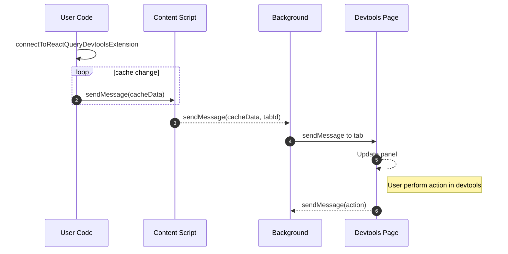

# React Query Devtools

This Project aims to create a browser extension to show the react-query devtools.

## Installation

Download the extension from Chrome web store (TODO: add link)

In the user's code

```bash
pnpm install -D react-query-devtools-extension
```

Connect your queryClient to the extension.
Use the same queryClient instance you use inside your app.

```tsx
import { QueryClient } from "react-query";
import { connectToExtension } from "react-query-devtools-extension";

const queryClient = new QueryClient();

connectToExtension(queryClient);
```

## Architecture


